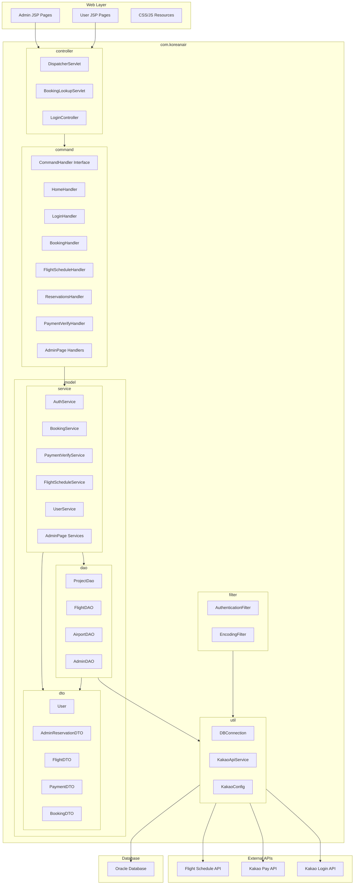
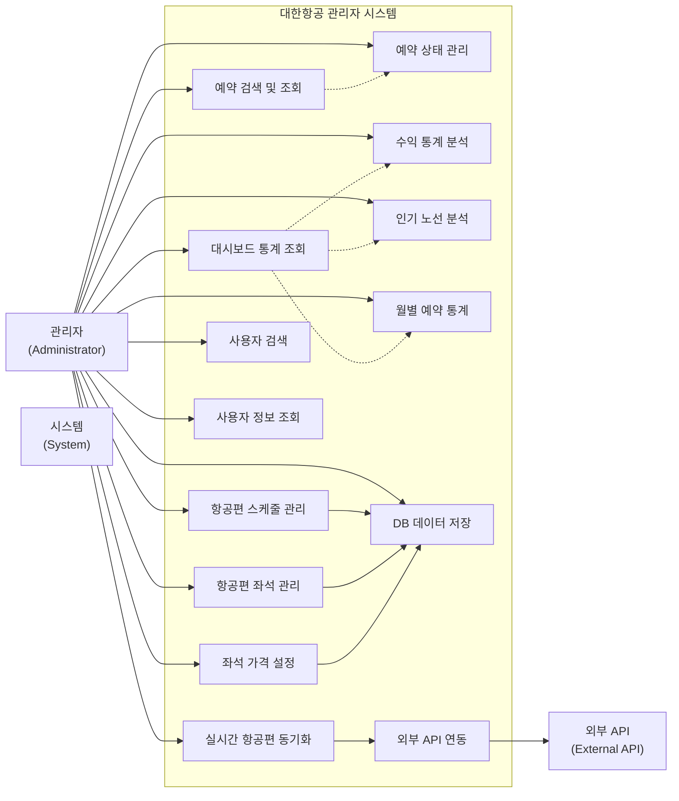
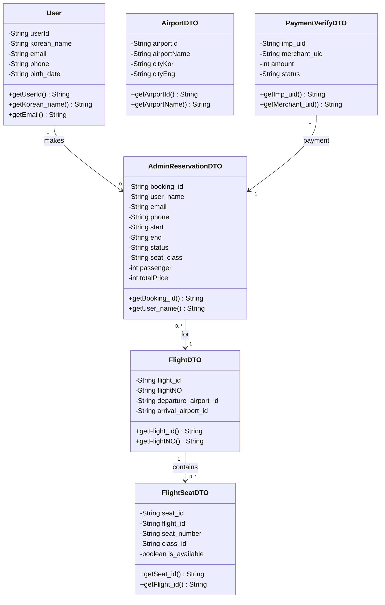
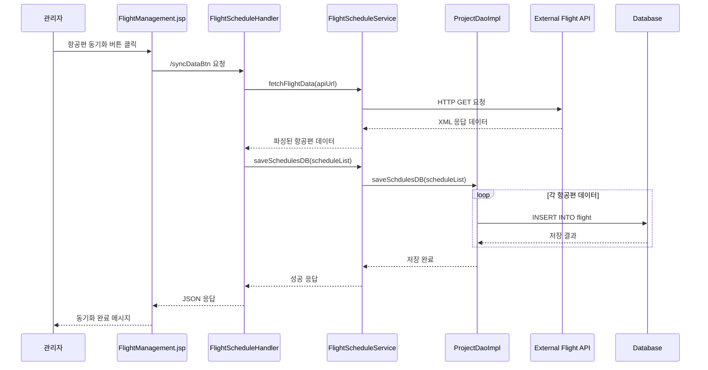
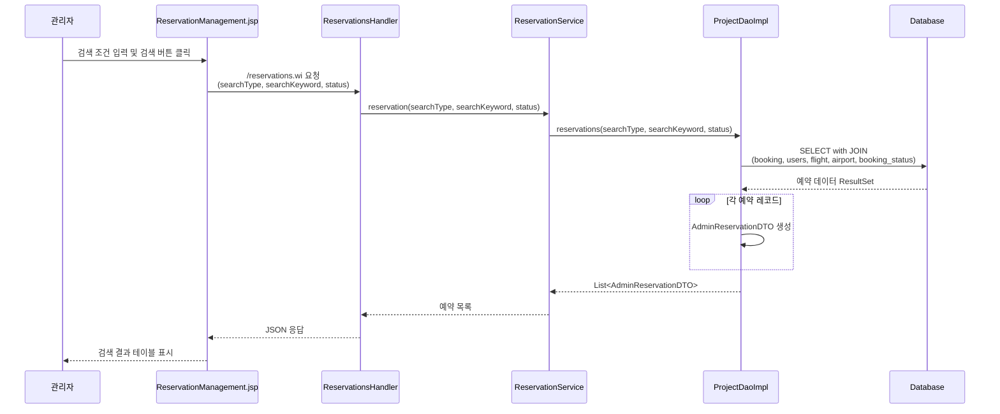
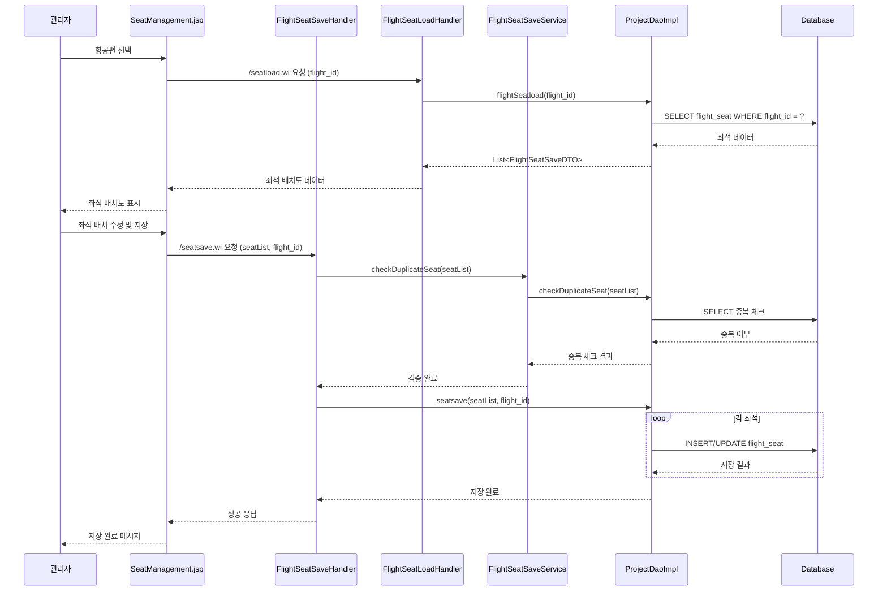
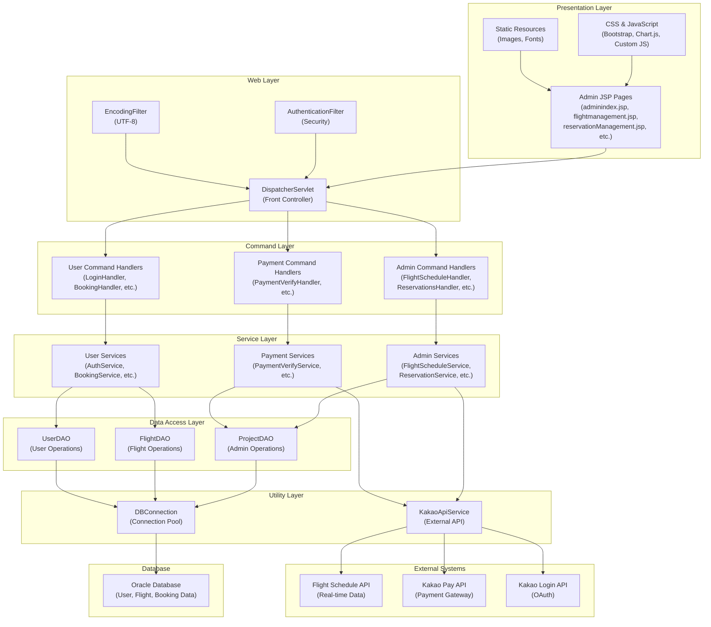
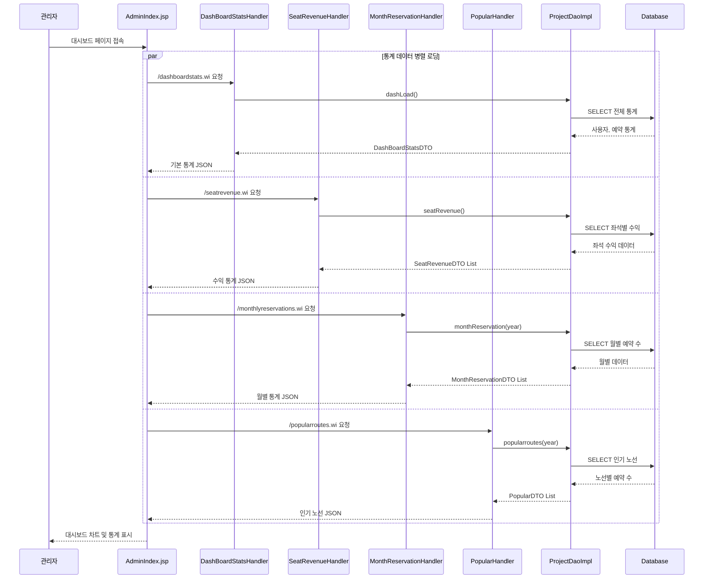
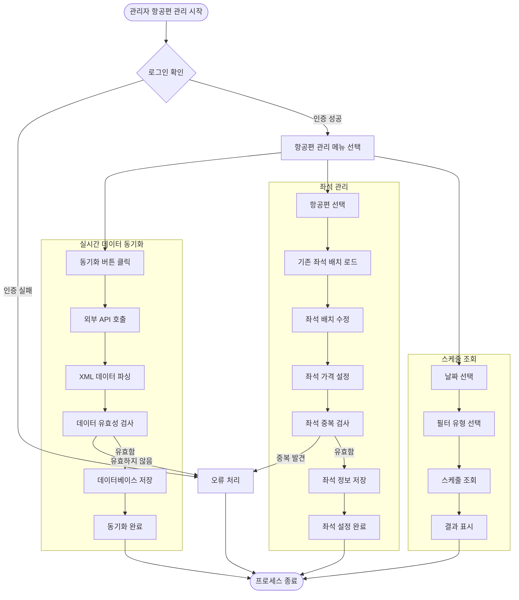
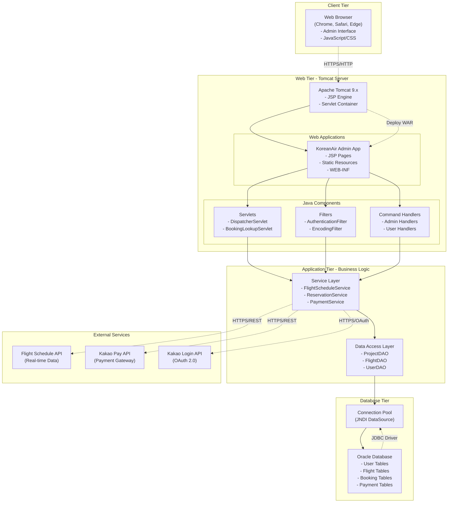

# 대한항공 관리자 시스템 UML 다이어그램

## 1. 패키지 다이어그램 (Package Diagram)

## 2. 유스케이스 다이어그램 (Use Case Diagram)

## 3. 클래스 다이어그램 (Class Diagram)

## 4. 시퀀스 다이어그램 - 항공편 스케줄 동기화

## 5. 시퀀스 다이어그램 - 예약 검색 및 조회

## 6. 시퀀스 다이어그램 - 좌석 관리

## 7. 컴포넌트 다이어그램 (Component Diagram)

## 8. 시퀀스 다이어그램 - 대시보드 통계 조회

## 9. 액티비티 다이어그램 (Activity Diagram)

## 10. 배치 다이어그램 (Deployment Diagram)

---

## 🌐 외부에서 보는 방법들

### 1. **Mermaid Live Editor** (추천)
- 웹사이트: https://mermaid.live/
- 위 코드를 복사해서 붙여넣으면 바로 렌더링됨
- PNG, SVG로 다운로드 가능

### 2. **GitHub/GitLab**
- 이 `.md` 파일을 GitHub/GitLab에 업로드하면 자동으로 렌더링됨

### 3. **Visual Studio Code**
- Mermaid Extension 설치 후 미리보기 가능

### 4. **Draw.io (diagrams.net)**
- Mermaid 코드를 import하여 편집 가능

### 5. **Notion, Obsidian 등**
- Mermaid 지원하는 노트 앱에서 사용 가능 